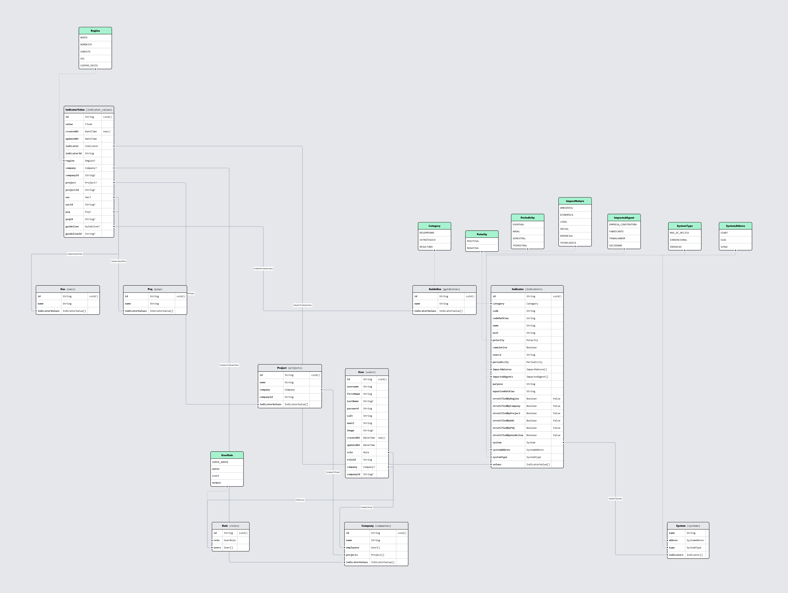

<h1 align="center">
  
</h1>

<!-- Foto de <a href="https://unsplash.com/pt-br/@victorfreitas?utm_content=creditCopyText&utm_medium=referral&utm_source=unsplash">Victor Freitas</a> na <a href="https://unsplash.com/pt-br/fotografias/fotografia-eyeview-de-worm-de-edificio-de-concreto-pO1sE4BItYE?utm_content=creditCopyText&utm_medium=referral&utm_source=unsplash">Unsplash</a> -->
  
Este repositório contém o código-fonte do Dashboard para visualização dos principais indicadores do Programa Brasileiro da Qualidade e Produtividade do Habitat (PBQP-H). O dashboard foi desenvolvido como parte do Termo de Execução Descentralizada N° 05/2021 - SNH/MDR.

## Funcionalidades
O dashboard oferece as seguintes funcionalidades:

- Visualização pública dos principais indicadores do PBQP-H
- Detalhes aprofundados de cada indicador (descrição, fórmula, gráficos, etc)
- Área administrativa com controle de acesso por login
  - Gerenciamento de usuários e permissões
  - Cadastro e edição de indicadores
  - Cadastro de construtoras e obras
  - Gerenciamento de entidades (PSQs, Diretrizes Sinat, OACs)
- Geração de relatórios e painéis customizáveis

## Tecnologias utilizadas

- **Front e Back-end**
  - [Next.js](https://nextjs.org)
  - [NextAuth.js](https://next-auth.js.org)
  - [Prisma](https://prisma.io)
  - [Tailwind CSS](https://tailwindcss.com)
  - [Shadcn UI](https://ui.shadcn.com)
  - [Lucide Icons](https://lucide.dev/)
  - [tRPC](https://trpc.io)

- **Hospedagem**
  - [Vercel\*](https://vercel.com)

- **Banco de dados**
  - [Neon\* (PostgreSQL)](https://neon.tech/)

- **Armazenamento de arquivos**
  - [UploadThing\*](https://uploadthing.com/)

\* Serviços com planos gratuitos, mas limitados. É recomendado modificar a configuração para um plano pago ou utilizar serviços alternativos para produção, como AWS.

## Arquitetura

## Esquema do banco de dados

<h1 align="center">
  
</h1>

O banco de dados é PostgreSQL e foi modelado utilizando o Prisma ORM.
Por mais que tenhamos modelado o banco de dados utilizando o Prisma, e este seja compatível com outros bancos de dados relacionais,
existem recursos específicos do PostgreSQL que não são suportados por outros SGBDs, como ENUMs.

É possível explorar de forma online o diagrama do banco de dados [aqui](https://prismaliser.app?code=Z2VuZXJhdG9yIGNsaWVudCB7CiAgcHJvdmlkZXIgPSAicHJpc21hLWNsaWVudC1qcyIKfQoKZGF0YXNvdXJjZSBkYiB7CiAgcHJvdmlkZXIgPSAicG9zdGdyZXNxbCIKICB1cmwgICAgICA9IGVudigiREFUQUJBU0VfVVJMIikKfQoKZW51bSBTeXN0ZW1BYmJyZXYgewogIFNpTkFUCiAgU2lBQwogIFNpTWFDCn0KCmVudW0gU3lzdGVtVHlwZSB7CiAgTkFPX1NFX0FQTElDQQogIENPTlZFTkNJT05BTAogIElOT1ZBQ0FPCn0KCm1vZGVsIFN5c3RlbSB7CiAgbmFtZSAgIFN0cmluZwogIGFiYnJldiBTeXN0ZW1BYmJyZXYKICB0eXBlICAgU3lzdGVtVHlwZQoKICBpbmRpY2F0b3JzIEluZGljYXRvcltdCgogIEBAdW5pcXVlKFthYmJyZXYsIHR5cGVdKQogIEBAbWFwKCJzeXN0ZW1zIikKfQoKZW51bSBJbXBhY3ROYXR1cmUgewogIEFNQklFTlRBTAogIEVDT05PTUlDQQogIExFR0FMCiAgU09DSUFMCiAgR0VSRU5DSUFMCiAgVEVDTk9MT0dJQ0EKfQoKZW51bSBJbXBhY3RlZEFnZW50IHsKICBFTVBSRVNBX0NPTlNUUlVUT1JBCiAgRkFCUklDQU5URQogIFRSQUJBTEhBRE9SCiAgU09DSUVEQURFCn0KCmVudW0gUG9sYXJpdHkgewogIFBPU0lUSVZBCiAgTkVHQVRJVkEKfQoKZW51bSBQZXJpb2RpY2l0eSB7CiAgRVZFTlRVQUwKICBBTlVBTAogIFNFTUVTVFJBTAogIFRSSU1FU1RSQUwKfQoKZW51bSBDYXRlZ29yeSB7CiAgREVTRU1QRU5ITwogIEVTVFJBVEVHSUNPCiAgUkVTVUxUQURPCn0KCmVudW0gUmVnaW9uIHsKICBOT1JURQogIE5PUkRFU1RFCiAgU1VERVNURQogIFNVTAogIENFTlRST19PRVNURQp9Cgptb2RlbCBJbmRpY2F0b3IgewogIGlkICAgICAgICAgICAgICBTdHJpbmcgICAgICAgICAgQGlkIEBkZWZhdWx0KGN1aWQoKSkKICBjYXRlZ29yeSAgICAgICAgQ2F0ZWdvcnkKICBjb2RlICAgICAgICAgICAgU3RyaW5nICAgICAgICAgIEB1bmlxdWUKICBjb2RlTWF0aEpheCAgICAgU3RyaW5nCiAgbmFtZSAgICAgICAgICAgIFN0cmluZwogIHVuaXQgICAgICAgICAgICBTdHJpbmcKICBwb2xhcml0eSAgICAgICAgUG9sYXJpdHkKICBjdW11bGF0aXZlICAgICAgQm9vbGVhbgogIHNvdXJjZSAgICAgICAgICBTdHJpbmcKICBwZXJpb2RpY2l0eSAgICAgUGVyaW9kaWNpdHkKICBpbXBhY3ROYXR1cmVzICAgSW1wYWN0TmF0dXJlW10KICBpbXBhY3RlZEFnZW50cyAgSW1wYWN0ZWRBZ2VudFtdCiAgcHVycG9zZSAgICAgICAgIFN0cmluZwogIGVxdWF0aW9uTWF0aEpheCBTdHJpbmcKCiAgc3RyYXRpZmllZEJ5UmVnaW9uICAgIEJvb2xlYW4gQGRlZmF1bHQoZmFsc2UpCiAgc3RyYXRpZmllZEJ5Q29tcGFueSAgIEJvb2xlYW4gQGRlZmF1bHQoZmFsc2UpCiAgc3RyYXRpZmllZEJ5UHJvamVjdCAgIEJvb2xlYW4gQGRlZmF1bHQoZmFsc2UpCiAgc3RyYXRpZmllZEJ5T0FDICAgICAgIEJvb2xlYW4gQGRlZmF1bHQoZmFsc2UpCiAgc3RyYXRpZmllZEJ5UFNRICAgICAgIEJvb2xlYW4gQGRlZmF1bHQoZmFsc2UpCiAgc3RyYXRpZmllZEJ5R3VpZGVsaW5lIEJvb2xlYW4gQGRlZmF1bHQoZmFsc2UpCgogIHN5c3RlbSAgICAgICBTeXN0ZW0gICAgICAgICAgIEByZWxhdGlvbihmaWVsZHM6IFtzeXN0ZW1BYmJyZXYsIHN5c3RlbVR5cGVdLCByZWZlcmVuY2VzOiBbYWJicmV2LCB0eXBlXSwgb25EZWxldGU6IENhc2NhZGUpCiAgc3lzdGVtQWJicmV2IFN5c3RlbUFiYnJldgogIHN5c3RlbVR5cGUgICBTeXN0ZW1UeXBlCiAgdmFsdWVzICAgICAgIEluZGljYXRvclZhbHVlW10KCiAgQEBtYXAoImluZGljYXRvcnMiKQp9Cgptb2RlbCBJbmRpY2F0b3JWYWx1ZSB7CiAgaWQgICAgICAgIFN0cmluZyAgIEBpZCBAZGVmYXVsdChjdWlkKCkpCiAgdmFsdWUgICAgIEZsb2F0CiAgY3JlYXRlZEF0IERhdGVUaW1lIEBkZWZhdWx0KG5vdygpKQogIHVwZGF0ZWRBdCBEYXRlVGltZSBAdXBkYXRlZEF0CgogIGluZGljYXRvciAgIEluZGljYXRvciBAcmVsYXRpb24oZmllbGRzOiBbaW5kaWNhdG9ySWRdLCByZWZlcmVuY2VzOiBbaWRdKQogIGluZGljYXRvcklkIFN0cmluZwoKICByZWdpb24gICAgICBSZWdpb24_CiAgY29tcGFueSAgICAgQ29tcGFueT8gICBAcmVsYXRpb24oZmllbGRzOiBbY29tcGFueUlkXSwgcmVmZXJlbmNlczogW2lkXSwgb25EZWxldGU6IENhc2NhZGUpCiAgY29tcGFueUlkICAgU3RyaW5nPwogIHByb2plY3QgICAgIFByb2plY3Q_ICAgQHJlbGF0aW9uKGZpZWxkczogW3Byb2plY3RJZF0sIHJlZmVyZW5jZXM6IFtpZF0sIG9uRGVsZXRlOiBDYXNjYWRlKQogIHByb2plY3RJZCAgIFN0cmluZz8KICBvYWMgICAgICAgICBPYWM_ICAgICAgIEByZWxhdGlvbihmaWVsZHM6IFtvYWNJZF0sIHJlZmVyZW5jZXM6IFtpZF0pCiAgb2FjSWQgICAgICAgU3RyaW5nPwogIHBzcSAgICAgICAgIFBzcT8gICAgICAgQHJlbGF0aW9uKGZpZWxkczogW3BzcUlkXSwgcmVmZXJlbmNlczogW2lkXSkKICBwc3FJZCAgICAgICBTdHJpbmc_CiAgZ3VpZGVsaW5lICAgR3VpZGVsaW5lPyBAcmVsYXRpb24oZmllbGRzOiBbZ3VpZGVsaW5lSWRdLCByZWZlcmVuY2VzOiBbaWRdKQogIGd1aWRlbGluZUlkIFN0cmluZz8KCiAgQEBtYXAoImluZGljYXRvcl92YWx1ZXMiKQp9Cgptb2RlbCBDb21wYW55IHsKICBpZCAgIFN0cmluZyBAaWQgQGRlZmF1bHQoY3VpZCgpKQogIG5hbWUgU3RyaW5nIEB1bmlxdWUKCiAgZW1wbG95ZWVzIFVzZXJbXQoKICBwcm9qZWN0cyAgICAgICAgUHJvamVjdFtdCiAgaW5kaWNhdG9yVmFsdWVzIEluZGljYXRvclZhbHVlW10KCiAgQEBtYXAoImNvbXBhbmllcyIpCn0KCm1vZGVsIFByb2plY3QgewogIGlkICAgU3RyaW5nIEBpZCBAZGVmYXVsdChjdWlkKCkpCiAgbmFtZSBTdHJpbmcgQHVuaXF1ZQoKICBjb21wYW55ICAgICAgICAgQ29tcGFueSAgICAgICAgICBAcmVsYXRpb24oZmllbGRzOiBbY29tcGFueUlkXSwgcmVmZXJlbmNlczogW2lkXSkKICBjb21wYW55SWQgICAgICAgU3RyaW5nCiAgaW5kaWNhdG9yVmFsdWVzIEluZGljYXRvclZhbHVlW10KCiAgQEBtYXAoInByb2plY3RzIikKfQoKbW9kZWwgR3VpZGVsaW5lIHsKICBpZCAgIFN0cmluZyBAaWQgQGRlZmF1bHQoY3VpZCgpKQogIG5hbWUgU3RyaW5nIEB1bmlxdWUgLy8gaW50IHN0cmluZzogMDAxLCAwMDIsIDAwMywgLi4uCgogIGluZGljYXRvclZhbHVlcyBJbmRpY2F0b3JWYWx1ZVtdCgogIEBAbWFwKCJndWlkZWxpbmVzIikKfQoKbW9kZWwgUHNxIHsKICBpZCAgIFN0cmluZyBAaWQgQGRlZmF1bHQoY3VpZCgpKQogIG5hbWUgU3RyaW5nIEB1bmlxdWUKCiAgaW5kaWNhdG9yVmFsdWVzIEluZGljYXRvclZhbHVlW10KCiAgQEBtYXAoInBzcXMiKQp9Cgptb2RlbCBPYWMgewogIGlkICAgU3RyaW5nIEBpZCBAZGVmYXVsdChjdWlkKCkpCiAgbmFtZSBTdHJpbmcgQHVuaXF1ZQoKICBpbmRpY2F0b3JWYWx1ZXMgSW5kaWNhdG9yVmFsdWVbXQoKICBAQG1hcCgib2FjcyIpCn0KCmVudW0gVXNlclJvbGUgewogIFNVUEVSX0FETUlOCiAgQURNSU4KICBTVEFGRgogIE1FTUJFUgp9Cgptb2RlbCBSb2xlIHsKICBpZCAgIFN0cmluZyAgIEBpZCBAZGVmYXVsdChjdWlkKCkpCiAgcm9sZSBVc2VyUm9sZSBAdW5pcXVlCgogIHVzZXJzIFVzZXJbXQoKICBAQG1hcCgicm9sZXMiKQp9Cgptb2RlbCBVc2VyIHsKICBpZCAgICAgICAgU3RyaW5nICAgQGlkIEBkZWZhdWx0KGN1aWQoKSkKICB1c2VybmFtZSAgU3RyaW5nICAgQHVuaXF1ZQogIGZpcnN0TmFtZSBTdHJpbmcKICBsYXN0TmFtZSAgU3RyaW5nPwogIHBhc3N3b3JkICBTdHJpbmcKICBzYWx0ICAgICAgU3RyaW5nCiAgZW1haWwgICAgIFN0cmluZyAgIEB1bmlxdWUKICBpbWFnZSAgICAgU3RyaW5nPwogIGNyZWF0ZWRBdCBEYXRlVGltZSBAZGVmYXVsdChub3coKSkKICB1cGRhdGVkQXQgRGF0ZVRpbWUgQHVwZGF0ZWRBdAoKICByb2xlICAgICAgUm9sZSAgICAgQHJlbGF0aW9uKGZpZWxkczogW3JvbGVJZF0sIHJlZmVyZW5jZXM6IFtpZF0sIG9uRGVsZXRlOiBDYXNjYWRlKQogIHJvbGVJZCAgICBTdHJpbmcKICBjb21wYW55ICAgQ29tcGFueT8gQHJlbGF0aW9uKGZpZWxkczogW2NvbXBhbnlJZF0sIHJlZmVyZW5jZXM6IFtpZF0sIG9uRGVsZXRlOiBDYXNjYWRlKQogIGNvbXBhbnlJZCBTdHJpbmc_CgogIEBAbWFwKCJ1c2VycyIpCn0K).

## Configuração do ambiente de desenvolvimento

- Clonar o repositório
- Instalar as dependências
  ```bash
  pnpm install
  ```
- Configurar as variáveis de ambiente no arquivo .env (ver arquivo `.env.example`)
- Executar o servidor de desenvolvimento
  ```bash
  pnpm dev
  ```
Configurar o banco de dados:
- Configurar o prisma
  ```bash
  pnpm prisma generate
  ```
- Seedar o banco de dados (opcional)
  ```bash
  pnpm prisma db seed
  ```

Por padrão, o servidor de desenvolvimento estará disponível em `http://localhost:3000`.
O seed do banco de dados é opcional e pode ser executado para popular o banco com dados fictícios.
